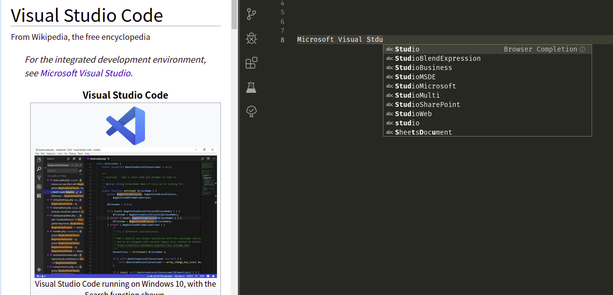

# vscode-browser-completion

Webpage words completion source for VS Code

---

---

## Installation

- **Make sure your 8888 port is open**

  That port is used to communicate with browser

- **Install the [browser extension](https://github.com/voldikss/browser-source-provider)**

  Browser extension grabs words from web page and send them to local server

- **Install this extension from the [marketplace](https://marketplace.visualstudio.com/VSCode)**

## Configurations

| Name                          | Default         | Description                                                 |
| ----------------------------- | --------------- | ----------------------------------------------------------- |
| `browserCompletion.capacity`  | `6`             | Count of cache files which are used to storage words, 1~10. |
| `browserCompletion.filetypes` | `['plaintext']` | Enable browser completion for those filetypes.              |

## Usage

Words from webpage will be added to completion candidates once you open a new page or refresh a page.

## References

- [coc-browser](https://github.com/voldikss/coc-browser) Webpage words completion in (Neo)Vim

- [browser-source-provider](https://github.com/voldikss/browser-source-provider) Browser extension used to grab words from webpage

## License

MIT
